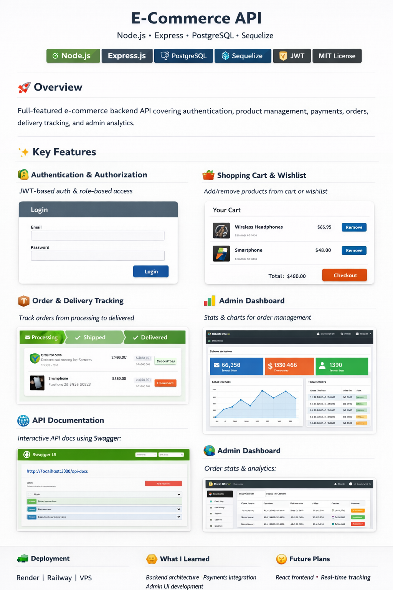

# E-Commerce API (Node.js + Express + PostgreSQL + Sequelize)

# 🛒 E-Commerce API

### Node.js • Express • PostgreSQL • Sequelize


---

## 🚀 Overview

I built this project as a **full-featured e-commerce backend API** designed to simulate real-world online store operations.

It handles everything from **user authentication and product management** to **payments, delivery tracking, notifications, and admin analytics**.

The architecture is designed to be:

- Scalable
- Modular
- Production-ready

---

## ✨ Key Features

### 🔐 Authentication & Authorization

- JWT-based authentication
- Role-based access control (Admin & User)

### 🛍️ Product Management

- Full CRUD operations
- Categories system
- Search & filtering (price, category)

🧠 Advanced UI STRUCTURE:
Views/
|
├── partials/
│ ├── \_cart.ejs
│ ├── \_checkout.ejs
│ ├── \_footer.ejs
│ ├── \_header.ejs
│ ├── \_navbar.ejs
│ └── \_sidebar.ejs
├── admin/
│ ├── dashboard.ejs
│ ├── orders.ejs
│ ├── products.ejs
│ └── users.ejs
├── cart.ejs
├── checkout.ejs
├── home.ejs
├── login.ejs
├── product.ejs
├── register.ejs
└── wishlist.ejs

### 🛒 Shopping Experience

- Cart system
- Wishlist functionality

### 📦 Orders & Checkout

- Order creation from cart
- Order items tracking
- Delivery lifecycle:
  - `processing → shipped → delivered`

### 💳 Payments

- Paystack integration
- Payment verification flow

### 🚚 Delivery System

- Address management
- Delivery fee calculation
- GPS-based delivery zones

### 📧 Notifications

- HTML Email notifications (Nodemailer)
- SMS alerts via Termii

### 📊 Admin Dashboard (EJS)

- Platform statistics
- Order management
- Delivery status updates
- Chart-based analytics

---

## 🧰 Tech Stack

| Layer    | Technology          |
| -------- | ------------------- |
| Backend  | Node.js, Express.js |
| Database | PostgreSQL          |
| ORM      | Sequelize           |
| Auth     | JWT                 |
| Payments | Paystack            |
| Email    | Nodemailer          |
| SMS      | Termii              |
| Views    | EJS                 |

---

## 📁 Project Structure

```bash id="dny3ea"
├── config/
├── controllers/
├── models/
├── routes/
├── middleware/
├── utils/
├── views/
├── docs/          # Swagger docs
├── .env
├── app.js
└── package.json
```

---

## ⚙️ Installation

```bash id="08y9mt"
git clone https://github.com/EdiCeM24/pro-.git
cd pro-
npm install
```

---

## 🔑 Environment Variables

Create a `.env` file:

```env id="rjqh2r"
DB_NAME=ecommerce
DB_USER=your_user
DB_PASS=your_password
DB_HOST=localhost

JWT_SECRET=your_secret

EMAIL_USER=your_email
EMAIL_PASS=your_password

PAYSTACK_SECRET_KEY=your_key
TERMII_API_KEY=your_key
```

---

## ▶️ Run the App

```bash id="gr9k6l"
npm run dev
```

---

## 📚 API Documentation (Swagger)

This project includes interactive API documentation using Swagger.

### 📦 Install Swagger

```bash id="zrr1xm"
npm install swagger-ui-express swagger-jsdoc
```

---

### ⚙️ Setup Swagger

📁 `config/swagger.js`

```js id="v8lqps"
const swaggerJsdoc = require("swagger-jsdoc");

const options = {
  definition: {
    openapi: "3.0.0",
    info: {
      title: "E-Commerce API",
      version: "1.0.0",
    },
  },
  apis: ["./routes/*.js"],
};

module.exports = swaggerJsdoc(options);
```

---

📁 `app.js`

```js id="v2a5e3"
const swaggerUi = require("swagger-ui-express");
const swaggerSpec = require("./config/swagger");

app.use("/api-docs", swaggerUi.serve, swaggerUi.setup(swaggerSpec));
```

---

### ✍️ Swagger Route Docs

```js id="6sxx7x"
/**
 * @swagger
 * /api/products:
 *   get:
 *     summary: Get all products
 *     responses:
 *       200:
 *         description: List of products
 */
```

---

### 🌐 Access Docs

```id="z9bmbb"
http://localhost:3000/api-docs
```

---

## 📊 Admin Dashboard

```id="j5m6bg"
/admin/dashboard
```

Includes:

- Platform stats
- Order management
- Delivery tracking
- Charts (Chart.js)

---

## 📸 Screenshots

> Add screenshots here (Admin dashboard, cart, etc.)

---

## 🌍 Deployment

- Render
- Railway
- VPS (Node.js + PostgreSQL)

---

## 🧠 What I Learned

- Designing scalable backend architecture
- Managing relational data with Sequelize
- Integrating real-world services (payments, SMS, email)
- Building admin dashboards with server-side rendering

---

## 🔮 Future Improvements

- Product image uploads (Cloudinary)
- Real-time order tracking
- Mobile app integration
- Advanced analytics dashboard

---

## 👨‍💻 Author

MARCUS EDIDIONG CLETUS

Developed as a production-style backend system to demonstrate real-world e-commerce architecture and integrations.

---

## 📄 License

MIT License

This is a full-featured e-commerce backend built with Node.js, Express, Sequelize, and PostgreSQL. It supports authentication, cart, orders, payments, admin dashboard, and more.

✅
